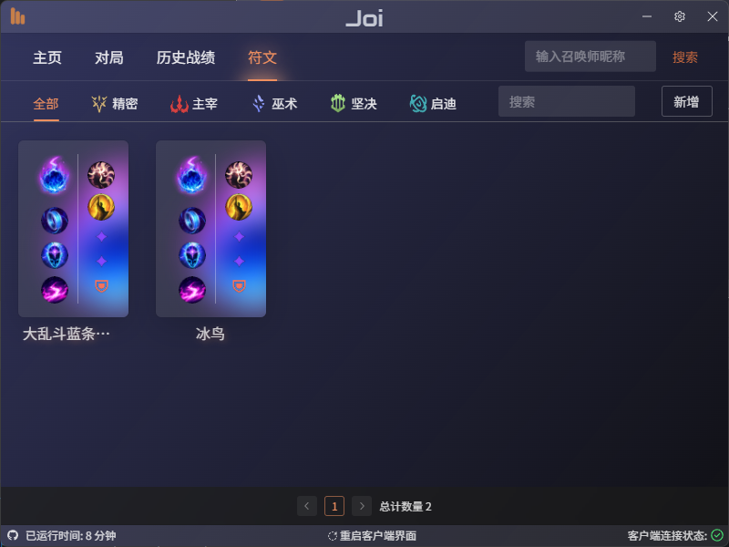
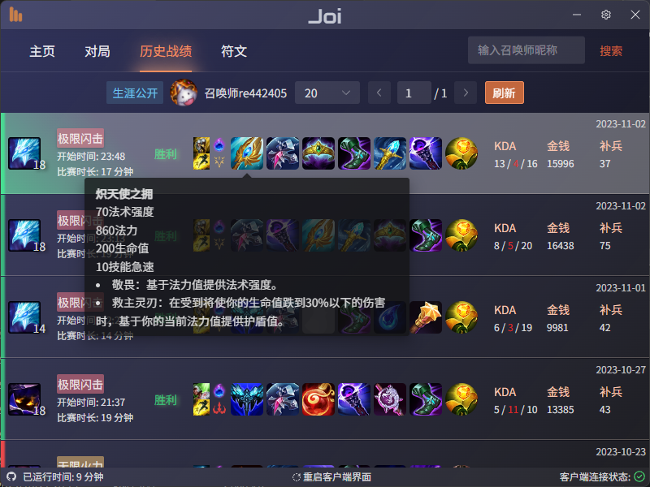
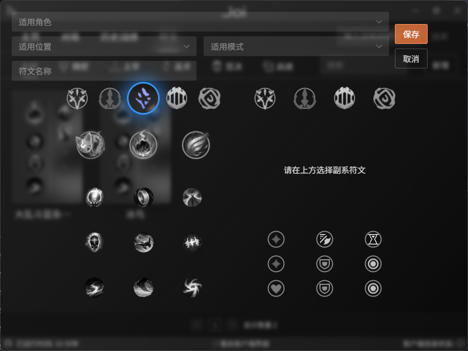

# Joi
另一个英雄联盟助手工具
用的electron框架，“小而美”，只要我还在玩lol，就会一直维护

计划：
- [x] 完成基本框架
- [x] 自动接受对局
- [x] 重启客户端界面进程功能
- [x] 个人战绩查询
- [x] sqlite3存储配置项
- [x] 战绩详情查询
- [x] 他人战绩查询
- [x] 设置项配置功能
- [x] 符文系统
- [ ] 发送聊天
- [ ] 小黑屋功能
- [ ] 对局分析
- [x] 应用检查更新功能

## 截图

